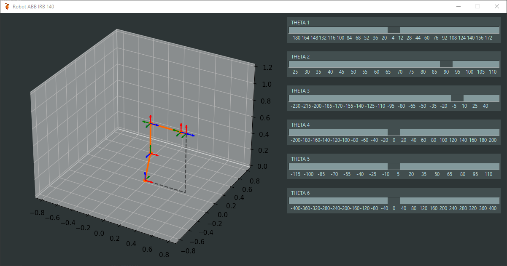

# Interactive ABB IRB 140

 The purpose of this repository is to show how the joints of the ABB IRB robot behave, reference systems. It is carried out through the use of a GUI with sliders of each of the 6 degrees of freedom of the robot.

Run the main script to view the GUI
 ```sh
 :~/interactive-abb-irb-140$ python main.py
 ```

## Preview

